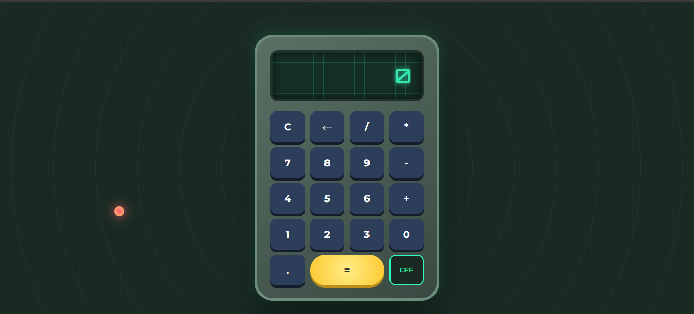

# 🐉 Dragon Radar Calculator

Uma calculadora temática inspirada no Radar do Dragão de Dragon Ball. Projeto focado em demonstrar o uso de **CSS Patterns**, **Arquitetura de Objetos no JS** e **Experiência de Usuário (UX)** imersiva.

> "Estudando para superar meus limites, estilo Gohan." ⚡

## 🚀 Demonstração

✨ **Acesse o projeto online:** [Dragon Radar Live](https://gustavodeoliveiradev.github.io/dragon-radar-calculator/)

---

## 🌟 Funcionalidades de Elite
- **Interface Imersiva:** Design metálico com estética de radar e fundo gerado puramente com CSS (`radial-gradients`).
- **Display Inteligente:** Tela com grade dinâmica, efeito de profundidade (`inset shadow`) e animação de pulso neon.
- **Arquitetura de Som:** Feedback auditivo 8-bit para ligar/desligar, erros e resultados.
- **Teclado Físico:** Suporte completo via `Event Listeners` (Números, Enter, Backspace e Esc).
- **Feedback Visual (Shenlong):** Animação de `shake` para erros e brilho dourado intenso ao encontrar o resultado (Esfera do Dragão).

## 🛠️ Tecnologias e Conceitos
- **HTML5:** Estrutura semântica e elementos de áudio.
- **CSS3 Avançado:** Custom Properties (Variáveis), Grid Layout, Pseudo-classes como `:has()` e Keyframes.
- **JavaScript Moderno:** Manipulação de DOM, Objetos para organização de estado, Regex para validação e Audio API.

## 🔧 Como rodar o projeto
1. Clone o repositório: `git clone https://github.com/gustavodeoliveiradev/dragon-radar-calculator.git`
2. Abra o arquivo `index.html` no seu navegador ou use o **Live Server** do VS Code.

## 📅 Diário de Bordo
- **Dia 1:** Estrutura base e lógica matemática.
- **Dia 2:** Tema Radar do Dragão, sistema de Power e Easter Egg.
- **Dia 3:** Grade no display, animação neon e refatoração de energia.
- **Dia 4:** Feedback Auditivo e unificação da lógica.
- **Dia 5:** Suporte a teclado, animação de erro e efeito visual "Esfera Encontrada".
- **Dia 6 (Final):** Refatoração completa para Clean Code, uso de Variáveis CSS e organização de objetos no JS.

---
Desenvolvido com ❤️ por [Gustavo](https://github.com/gustavodeoliveiradev).